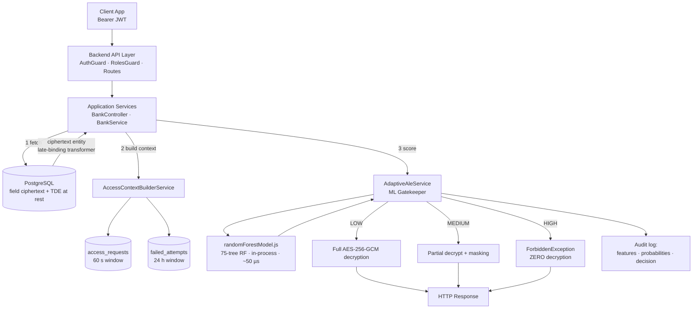
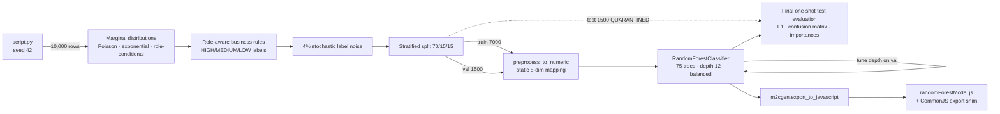
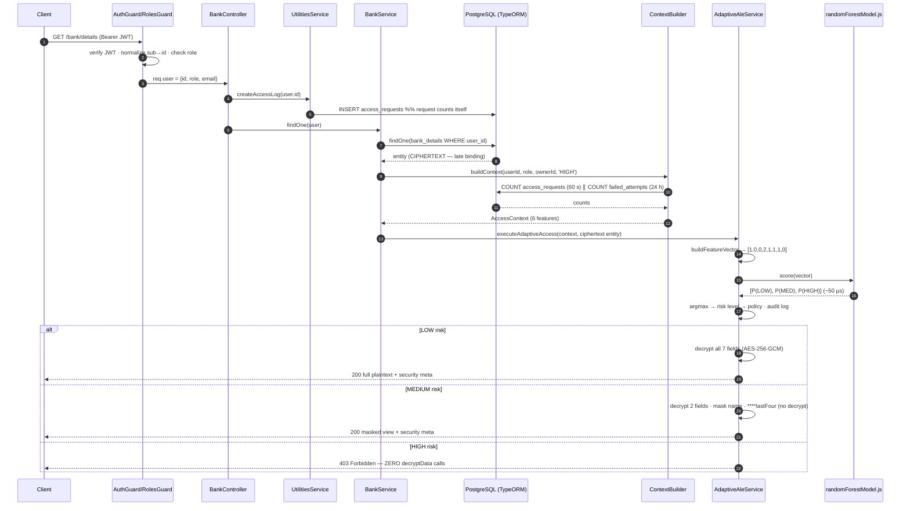

# A Machine Learning–Driven Adaptive Data Access and Decryption Control Framework for Secure Application Systems Using Encrypted Databases

**Project Report — Adaptive Data Access Framework with ML-Driven Late-Binding Application-Level Encryption (ALE)**

*Technology stack: NestJS (Node.js/TypeScript) modular monolith · PostgreSQL · TypeORM · AES-256-GCM · scikit-learn · m2cgen*

---

## Abstract

Conventional enterprise applications protect sensitive data **at rest** (storage-level and field-level encryption) and **in transit** (TLS), yet the moment an authenticated request reaches the persistence layer, encrypted fields are decrypted *unconditionally* — before any behavioral assessment of the request can occur. This creates a **data-in-use vulnerability**: an attacker who passes static authentication (a stolen token, a compromised account, an insider) receives fully decrypted plaintext regardless of how anomalous the access pattern is. This work designs, implements, and evaluates a framework that closes this gap by inserting a **machine-learning-driven adaptive decryption control layer** between database retrieval and data exposure. The framework (i) re-engineers the Object-Relational Mapper (ORM) so that ciphertext — not plaintext — is returned from the database ("late-binding cryptography"), (ii) extracts a behavioral feature vector from every request at runtime, (iii) scores the request's risk with a 75-tree Random Forest classifier transpiled to dependency-free JavaScript executing in-process in ~50 µs, and (iv) enforces one of three graduated cryptographic policies: full decryption, partial decryption with masking, or outright denial in which **no plaintext is ever materialized in server memory**. On a quarantined test set of 1,500 samples the classifier achieves a weighted F1-score of 0.9777, intercepting 92.8 % of simulated attack vectors while passing 99.14 % of legitimate requests unimpeded. End-to-end runtime verification confirms that the same endpoint returns full plaintext, a masked view, or an HTTP 403 purely as a function of runtime behavior.

**Keywords:** adaptive access control · application-level encryption · data-in-use protection · risk-based authorization · Random Forest · model transpilation · Zero Trust

---

## Table of Contents

1. [Introduction](#1-introduction)
2. [Background and Threat Model](#2-background-and-threat-model)
3. [Backend Security Architecture](#3-backend-security-architecture)
4. [Feature Engineering](#4-feature-engineering)
5. [Synthetic Dataset Generation](#5-synthetic-dataset-generation)
6. [Model Selection and Training](#6-model-selection-and-training)
7. [Model Transpilation to Zero-Dependency JavaScript](#7-model-transpilation-to-zero-dependency-javascript)
8. [Model Integration with the Backend](#8-model-integration-with-the-backend)
9. [Runtime Pipeline: From Request to Adaptive Response](#9-runtime-pipeline-from-request-to-adaptive-response)
10. [Evaluation](#10-evaluation)
11. [Security Analysis](#11-security-analysis)
12. [Limitations and Future Work](#12-limitations-and-future-work)
13. [Conclusion](#13-conclusion)
- [Appendix A — Reproducibility](#appendix-a--reproducibility)
- [Appendix B — Source File Map](#appendix-b--source-file-map)
- [Appendix C — Project Invariants](#appendix-c--project-invariants)

---

## 1. Introduction

### 1.1 Problem Statement

Modern data-protection practice is organized around the three states of data: **at rest**, **in transit**, and **in use**. The first two states are well served by mature, widely deployed mechanisms — Transparent Data Encryption (TDE) and storage-level encryption for data at rest, TLS for data in transit. The third state is the weakest link in ordinary application systems.

Consider a typical enterprise backend built on an ORM such as TypeORM. Sensitive columns (bank account numbers, national identity numbers, IBANs) are encrypted at the application level before storage. When any authenticated request triggers a database read, the ORM's *value transformer* mechanism decrypts every encrypted column **automatically and unconditionally** during entity hydration:

```typescript
// Standard (flawed) transformer — decryption happens during ORM hydration:
from(value: string | null | undefined): string | null {
  if (!value) return null;
  return decryptData(value);   // plaintext in RAM before ANY risk evaluation
}
```

The decryption therefore occurs **before** the business layer can evaluate *who* is asking, *how often*, *from what context*, and *for whose records*. If the requester is executing an Insecure Direct Object Reference (IDOR) attack, running a high-velocity scraping script, or operating a compromised account after a credential-stuffing campaign, the plaintext has already materialized in the server's heap by the time any application-level check could throw an exception. Static access control (RBAC/ABAC) does not solve this: it answers *"may this role call this endpoint?"* once, at the gate, and its verdict is binary — it cannot modulate *how much* data is exposed in response to *runtime* behavior.

### 1.2 Research Gap

Industry systems widely deploy: (i) TDE / storage encryption (data at rest), (ii) application-level field encryption (data before storage), and (iii) static role- or attribute-based access control. What is largely absent is a layer that **adaptively controls decryption and data exposure at runtime, per request, as a function of behavioral risk**. Specifically missing are: ML-driven decryption policies, adaptive response masking, runtime encryption/decryption decision logic, and per-request security behavior. Zero Trust architectures come philosophically closest — they advocate continuous, risk-based verification — but existing implementations govern *authentication and network access*, not *decryption behavior and data-exposure granularity*.

### 1.3 Contributions

This project makes four concrete contributions:

1. **Late-Binding Cryptography.** The ORM retrieval path is re-engineered so that encrypted fields survive entity hydration as ciphertext. Decryption becomes an explicit, policy-gated action rather than an implicit side effect of a database read.
2. **A runtime behavioral risk model.** A Random Forest classifier, trained on a synthetically generated but domain-rule-grounded access-log corpus, maps an 8-dimensional feature vector (role, resource sensitivity, temporal context, ownership, velocity, authentication friction) to a three-tier risk level.
3. **Zero-dependency in-process inference.** The trained scikit-learn model is transpiled by `m2cgen` into pure JavaScript arithmetic and executed natively inside the Node.js V8 runtime — eliminating Python runtimes, inference microservices, and network hops from the hot path. Measured warm inference latency is ~50 µs.
4. **Graduated cryptographic policy enforcement.** Risk levels map to three mutually exclusive policies — `FULL_DECRYPT`, `PARTIAL_MASK`, `ACCESS_DENIED` — with the crucial property that on the denial path **zero decryption calls execute**, so no plaintext ever exists in memory to leak.

### 1.4 Thesis Statement

> Existing systems commonly use Transparent Data Encryption to protect data at rest and application-level encryption to protect sensitive fields before storage. However, these approaches apply static protection policies and do not adaptively control how decrypted data is exposed during runtime. This work proposes and implements an ML-driven adaptive decryption and data-exposure control framework that evaluates request context, user behavior, and access risk to dynamically decide whether data should be fully decrypted, partially decrypted and masked, or denied — before any plaintext is produced.

---

## 2. Background and Threat Model

### 2.1 The Three States of Data and Their Protections

| Data state | Existing mechanism | Granularity | Adaptivity |
|---|---|---|---|
| At rest | TDE, storage/disk encryption, encrypted backups | database / file | none (static) |
| Before storage | Application-level field encryption (ALE) | column / field | none (static policy) |
| In transit | TLS | connection | none |
| **In use** | **(this work)** adaptive decryption control | **per request, per field** | **ML-driven, behavioral** |

**Transparent Data Encryption (TDE)** encrypts database files, backups, and storage-level artifacts. It defends against theft of physical media, filesystem snapshots, and backup exfiltration. It is *transparent* precisely because the database engine decrypts pages automatically for any authenticated connection — which is also its limitation: TDE offers **no protection whatsoever once the application queries the data**. In this architecture, TDE (or its deployment-level equivalent, e.g., encrypted volumes / cloud-managed storage encryption for PostgreSQL) constitutes Layer 1 and is treated as a deployment concern.

**Application-Level Encryption (ALE)** encrypts selected sensitive fields *inside the application* before they are handed to the database driver. Its security value: the database, its administrators, its logs, and any SQL-injection read primitive see only ciphertext; key custody remains with the application. Its traditional weakness: retrieval symmetrically decrypts everything, statically.

**Static access control (RBAC/ABAC)** gates endpoints by role or attributes. It is necessary but insufficient: it is binary (grant/deny), evaluated against static facts, and blind to behavioral anomalies of an *authorized* principal.

### 2.2 Threat Model

The framework targets the class of attacks that **defeat static authentication/authorization but exhibit anomalous runtime behavior**:

| Threat | Vector | Static defenses bypassed | Behavioral signature |
|---|---|---|---|
| **High-velocity scraping / bulk exfiltration** | valid session, automated requests | authn ✓, RBAC ✓ | request velocity ≫ human baseline |
| **IDOR / lateral enumeration** | valid session, other users' record identifiers | authn ✓ (RBAC often ✓) | `record_owner_match = 0` on sensitive resources |
| **Credential stuffing / brute force → account takeover** | eventually valid credentials | authn ✓ after success | burst of failed logins immediately before access |
| **Compromised privileged account** | stolen admin/moderator token | authn ✓, RBAC ✓ | off-hours access, unusual volume, sensitive targets |
| **Insider misuse** | legitimate credentials | all static controls ✓ | cross-record access patterns, volume anomalies |

Out of scope: attacks on the cryptographic primitives themselves, kernel-level memory forensics of the *permitted* decryption path, denial-of-service, and network-layer attacks (delegated to TLS and infrastructure).

The defender's key asset is **ordering**: because ciphertext is preserved through retrieval, the risk decision executes *before* any plaintext exists. A correct HIGH-risk classification therefore prevents exposure absolutely, rather than detecting it after the fact.

---

## 3. Backend Security Architecture

### 3.1 Layered Architecture Overview

The system is a NestJS modular monolith over PostgreSQL/TypeORM, organized into eight security-relevant layers:

```
Layer 1  Client Interaction Layer          (web / API consumer, Bearer JWT)
Layer 2  Backend/API Security Layer        (AuthGuard: JWT verify; RolesGuard: static RBAC)
Layer 3  Application Business Logic Layer  (controllers, domain services, access logging)
Layer 4  Adaptive ML Decryption Control    (feature extraction → Random Forest → policy)   ← CORE CONTRIBUTION
Layer 5  Application-Level Encryption      (AES-256-GCM field encryption, late binding)
Layer 6  Database Access Layer             (TypeORM repositories, value transformers)
Layer 7  TDE-Protected Storage Layer       (storage-level encryption of DB files/backups)
Layer 8  Audit & Feedback Layer            (access_requests, failed_attempts, decision logs)
```

**Architectural diagram (component view):**



### 3.2 Authentication and Static RBAC (Layers 2–3)

Authentication is stateless JWT. On sign-in, the server issues a short-lived access token and a long-lived refresh token whose SHA-256 digest is bcrypt-hashed and stored server-side; refresh-token reuse (a theft indicator) revokes the session and is *recorded as a failed attempt* — feeding the behavioral layer. The `AuthGuard` verifies the token signature/expiry and attaches a normalized identity to the request:

```typescript
request['user'] = { ...payload, id: payload.sub };
```

The normalization of the JWT `sub` claim into `id` is deliberate and centralized: every downstream consumer (ownership checks, access logging, repository queries) reads `user.id`. During development, the absence of this normalization produced a subtle broken-access-control defect — TypeORM silently removes `undefined` values from `WHERE` clauses, so `findOne({ where: { id: undefined } })` degenerates to `SELECT … LIMIT 1` and returns *the first row of the table*. The single-point normalization eliminates the entire class of bugs.

`RolesGuard` then enforces conventional route-level RBAC via reflection on `@Roles(...)` metadata. This layer intentionally remains: the adaptive layer *augments* rather than replaces static control (defense in depth). The role hierarchy is `customer` (self-owned resources), `moderator` (support tier, cross-user read on low/medium sensitivity), `admin` (full scope, subject to the strictest behavioral monitoring).

### 3.3 Application-Level Encryption (Layer 5)

#### 3.3.1 Cryptographic design

- **Algorithm:** AES-256-GCM (authenticated encryption; confidentiality + integrity + tamper detection via the GCM auth tag).
- **Key:** a 32-byte key supplied as a 64-character hex environment variable (`DB_ENCRYPTION_KEY`), validated at startup by regular expression; the key never resides in the database or the repository.
- **IV policy:** a cryptographically random 12-byte IV per encryption operation (never reused; GCM's security requires IV uniqueness under a given key).
- **Ciphertext wire format:** a versioned, colon-delimited envelope enabling future algorithm agility:

```
v1 : <iv (24 hex chars)> : <authTag (32 hex chars)> : <ciphertext (hex)>
```

Decryption (`decryptData`) parses and validates all four components (version match, IV length, tag length, non-empty payload) before constructing the decipher, and GCM tag verification rejects any tampered ciphertext.

#### 3.3.2 Encrypted schema

The protected aggregate is the `bank_details` table (`BankInfoEntity`). Seven columns carry the encryption transformer: `branch_name`, `account_holder_name_enc`, `account_number_enc`, `routing_number_enc`, `swift_code_enc`, `iban_enc`, `identity_number_enc`. Two design details matter for the adaptive layer:

- **`account_last_four`** is stored deliberately in plaintext (4 characters). It later allows the MEDIUM-risk policy to render `****6789` **without performing any decryption** — a masking operation with zero ciphertext exposure.
- Non-sensitive metadata (`account_type`, `status`) remain plaintext for query ability.

#### 3.3.3 The write path (data before storage)

TypeORM's `ValueTransformer.to()` runs on save; every sensitive field is encrypted inside the application before the SQL driver ever sees it:

```
DTO: { "accountNumberEnc": "123456789" }
  → EncryptionTransformer.to() → encryptData()
  → stored: "v1:77fe…:0a1b…:c3d4…"
```

The database therefore never stores, logs, or indexes sensitive plaintext.

#### 3.3.4 The retrieval flaw and the Late-Binding redesign

The pivotal design decision of the whole framework is what `from()` — invoked automatically during entity hydration — does. The standard implementation decrypts (§ 1.1), creating the data-in-use vulnerability. The redesigned transformer **refuses to decrypt**:

```typescript
export class EncryptionTransformer implements ValueTransformer {
  to(value) {                     // save path: encrypt (data-at-rest protection)
    if (!value) return null;
    return encryptData(value);
  }
  from(value) {                   // load path: LATE BINDING — return ciphertext
    return value || null;         // e.g. "v1:iv:authTag:cipher"
  }
}
```

Consequences:

1. `bankRepo.findOne(...)` returns an entity whose sensitive properties are ciphertext strings. **No plaintext exists in process memory after retrieval.**
2. Decryption becomes an explicit call (`decryptData`) that only one component — the adaptive gatekeeper — is permitted to make, *after* risk evaluation.
3. The decision ordering inverts from *decrypt → (maybe) authorize* to **authorize (adaptively) → (maybe, partially) decrypt** — the property the thesis is named for.

### 3.4 Transparent Data Encryption (Layer 7)

TDE complements ALE at the storage boundary. In this architecture its responsibilities are: database file encryption, backup encryption, and storage-level protection. For PostgreSQL deployments this layer is realized operationally (encrypted volumes / cloud-provider storage encryption or TDE-capable distributions), and is treated as a deployment prerequisite rather than application code. The layering yields two independent protections for stored data — field-level ciphertext *inside* a TDE-encrypted store — so a compromise of either layer alone discloses nothing:

| Attack on storage | TDE alone | ALE alone | TDE + ALE (this work) |
|---|---|---|---|
| Stolen disk / backup | ✓ blocked | ✓ blocked (fields) | ✓ blocked twice |
| Malicious DBA / DB credential theft | ✗ (engine decrypts) | ✓ (sees ciphertext) | ✓ |
| SQL injection read | ✗ | ✓ | ✓ |
| Authenticated app-layer abuse (IDOR, scraping) | ✗ | ✗ (static ALE decrypts) | **✓ via Layer 4 (adaptive)** |

The last row is the research gap this work fills.

### 3.5 Audit and Feedback Layer (Layer 8)

Every request leaves durable artifacts that simultaneously serve as **security telemetry** and as the **feature source** for the model:

- `access_requests(id, user_id, created_at)` — one row per authenticated data access, inserted *before* the domain service executes; composite index on `(user_id, created_at)`.
- `failed_attempts(id, user_id, created_at)` — one row per failed password verification or refresh-token-reuse event.
- Structured decision logs — for every scored request: the exact feature vector, the class-probability vector, the decision, and inference latency. These logs constitute the evaluation evidence base and close the feedback loop for future retraining.

---

## 4. Feature Engineering

### 4.1 Feature Selection Criteria

Features were selected against five explicit criteria:

1. **Attack discriminativeness** — each feature must separate at least one threat in the threat model (§ 2.2) from legitimate behavior.
2. **Runtime extractability** — the feature must be computable at request time from server-controlled sources only (JWT claims, server clock, database state). *Nothing client-supplied is trusted.*
3. **Low latency** — extraction must add at most a few milliseconds (indexed counts, in-memory comparisons); the security layer must not become a performance tax.
4. **Transpilation compatibility** — features must reduce to plain numerics via *stateless* mappings, because stateful sklearn preprocessors (fitted encoders/scalers) cannot be exported to JavaScript (§ 7.1).
5. **Explainability** — every feature must carry a defensible cybersecurity interpretation, so that model decisions can be audited and justified (essential for a security control).

### 4.2 The Six Business Features

| # | Feature | Type | Runtime source | Security rationale |
|---|---|---|---|---|
| 1 | `user_role` | categorical {customer, moderator, admin} | verified JWT claim | privilege context; identical behavior means different things at different privilege levels |
| 2 | `resource_sensitivity` | ordinal {LOW=0, MEDIUM=1, HIGH=2} | **static, developer-declared** at the domain call site (`'HIGH'` for bank details) | data classification tier; the model learns how behavior interacts with the tier — sensitivity itself is a design-time fact about the data, never inferred from the request (a client could lie) |
| 3 | `is_office_hours` | binary | server clock: Mon–Fri, 09:00 ≤ h < 17:00 | temporal anomaly; off-hours access to sensitive data is a classic insider/compromise indicator |
| 4 | `record_owner_match` | binary | JWT `id` **vs. the fetched row's** `user_id` column | IDOR detection; comparing token identity to the database row's owner (not to any URL parameter) makes the check unforgeable |
| 5 | `recent_request_count` | integer | `COUNT(*)` over `access_requests` where `created_at > NOW() − 60 s` (indexed) | velocity; the primary signature of automated scraping/exfiltration |
| 6 | `failed_attempt_count` | integer | `COUNT(*)` over `failed_attempts` where `created_at > NOW() − 24 h` (indexed) | authentication friction; a burst of failures preceding access marks credential-stuffing / brute-force account takeover |

Design notes on the two windowed features:

- **60-second velocity window.** This matches the training-data definition exactly (queries per 60 s, § 5.2). The request being scored is *included in its own count* — the access log row is inserted before scoring — so an attacker's 30th request is evaluated as the 30th, and the count is ≥ 1 by construction.
- **24-hour failure window.** The training distribution models "failed attempts prior to request" without a time dimension; the runtime realizes it as a 24-hour database count. The window is deliberately long: a short window would zero out precisely when a credential-stuffing attacker finally succeeds and begins reading data — the exact moment the feature exists to catch. (The counter-reset-on-success alternative and its trade-offs are discussed in § 12.)

### 4.3 Encoded Model Feature Vector (8 dimensions)

The 6 business features expand to an **8-element numeric vector** (one-hot role, ordinal sensitivity, passthrough numerics). The index order is a **project invariant** shared verbatim between Python training and TypeScript runtime — any reordering silently corrupts predictions:

| Index | Model feature | Encoding |
|---|---|---|
| 0 | `role_customer` | `role == 'customer' ? 1 : 0` |
| 1 | `role_moderator` | `role == 'moderator' ? 1 : 0` |
| 2 | `role_admin` | `role == 'admin' ? 1 : 0` |
| 3 | `resource_sensitivity` | LOW=0 · MEDIUM=1 · HIGH=2 |
| 4 | `is_office_hours` | 0/1 |
| 5 | `record_owner_match` | 0/1 |
| 6 | `recent_request_count` | integer ≥ 1 |
| 7 | `failed_attempt_count` | integer ≥ 0 |

### 4.4 Target Variable

`risk_level ∈ {0, 1, 2}` with a direct policy semantics: **0 = LOW → full decryption**, **1 = MEDIUM → partial masking**, **2 = HIGH → access denied**. Framing the problem as 3-class classification (rather than binary allow/deny or unbounded anomaly scoring) is itself a design decision: it gives the policy engine a *graduated* middle response that preserves workflow continuity for borderline behavior instead of hard-blocking it.

---

## 5. Synthetic Dataset Generation

Real labeled corpora of application-layer access decisions do not publicly exist at field granularity, and production logs from a live banking system are neither available nor ethically usable for an undergraduate project. The corpus is therefore **synthesized under an explicit generative policy** (`src/core/ml/dataset/script.py`), designed for realism, class imbalance fidelity, reproducibility, and controlled label noise.

### 5.1 Generation Policy Overview

- **Size:** 10,000 samples. **Seed:** `numpy.random.seed(42)` — the corpus is bit-for-bit reproducible.
- **Pipeline:** (1) sample marginal feature distributions → (2) label by role-aware nonlinear business rules → (3) inject 4 % stochastic label noise → (4) stratified 70/15/15 split.

### 5.2 Feature Marginal Distributions

| Feature | Distribution | Parameters / rationale |
|---|---|---|
| `user_role` | categorical | P(customer)=0.75, P(moderator)=0.20, P(admin)=0.05 — read traffic is customer-dominated |
| `resource_sensitivity` | categorical | P(LOW)=0.60, P(MEDIUM)=0.30, P(HIGH)=0.10 — most reads touch low/medium fields |
| `is_office_hours` | Bernoulli | P(1)=0.80 — operational-hours dominance |
| `record_owner_match` | **role-conditional** Bernoulli | customers: P(own record)=0.95 (the 5 % complement models IDOR/enumeration attempts); moderators/admins: P(match)=0.15 — cross-user review is their *normal* job. This conditioning teaches the model that `owner_match=0` is benign for staff but suspicious for customers |
| `recent_request_count` | **Poisson(λ=4) + injected attack mass**: a random 5 % of rows are overwritten with `Uniform{15…64}` | the Poisson body models organic human browsing (1–6 req/min); the injected tail models scraping bursts — a bimodal mixture matching real exfiltration traffic |
| `failed_attempt_count` | discrete exponential-decay over {0…8}: P = [0.88, 0.05, 0.025, 0.015, 0.01, 0.008, 0.006, 0.004, 0.002] | 88 % of requests follow zero failures; the long tail models brute-force campaigns |

### 5.3 Labeling: Role-Aware Nonlinear Business Rules

Labels are assigned by a security-domain-expert rule system, evaluated per row (first match wins within each tier; HIGH rules dominate MEDIUM):

**HIGH risk (2) — active attack / exfiltration signatures:**

| Rule | Interpretation |
|---|---|
| customer ∧ owner_match=0 ∧ sensitivity ∈ {MEDIUM, HIGH} | IDOR on protected data |
| customer ∧ req_count > 15 | scraping velocity |
| moderator ∧ sensitivity = HIGH | support tier has no business on HIGH data |
| moderator ∧ req_count > 25 ∧ owner_match=0 | bulk cross-record harvesting |
| admin ∧ off-hours ∧ sensitivity=HIGH ∧ req_count > 20 | compromised super-user pattern |
| failed_attempts ≥ 5 (any role) | post-brute-force account takeover |

**MEDIUM risk (1) — suspicious but plausible:**

| Rule | Interpretation |
|---|---|
| customer ∧ owner_match=0 ∧ sensitivity=LOW | cross-record access on public-tier data |
| customer ∧ req_count ∈ [9, 15] | elevated velocity, below attack threshold |
| moderator ∧ off-hours ∧ sensitivity=MEDIUM | unusual time for support work on PII |
| admin ∧ failed_attempts ∈ {3, 4} | moderate authentication friction on a privileged account |
| (moderator ∨ admin) ∧ req_count > 18 | staff-tier volume anomaly |

All remaining traffic is LOW (0). Two properties of this rule system deserve emphasis for the methodology chapter: it is **deeply conditional** (every rule is a conjunction across 2–4 features — the reason a linear model underperforms, § 6.1), and it is **role-asymmetric** (the same feature value flips meaning across roles), which forces the model to learn interactions rather than thresholds.

### 5.4 Controlled Label Noise

4 % of rows receive a random label re-draw (P = [0.7, 0.2, 0.1] over classes). Rationale: a noise-free rule-labeled corpus would let a tree ensemble memorize the rules to a trivially perfect score, producing (i) an unrealistically clean decision surface and (ii) no measurable generalization gap. The noise floor models real-world labeling ambiguity (analyst disagreement, borderline incidents) and caps achievable accuracy at a realistic ceiling — observed final accuracy (97.8 %) sits appropriately just under the ~96 % clean-label ceiling implied by 4 % noise plus class-conditional overlap.

### 5.5 Stratified Split and Leakage Control

`train_test_split(..., stratify=risk_level, random_state=42)` twice: 70 % train (7,000) / 15 % validation (1,500) / 15 % test (1,500). Stratification preserves the class imbalance in each partition (test support: 1,274 LOW / 87 MEDIUM / 139 HIGH ≈ 85 : 6 : 9). The test partition is **quarantined**: it is untouched during training and hyperparameter tuning and is used exactly once for the final metrics of § 10.1.

The class imbalance is *intentional and preserved* (rather than rebalanced by oversampling): the deployment prior really is "most traffic is benign," and the evaluation must measure minority-class recall under that prior. The imbalance is instead compensated in the learner (`class_weight='balanced'`, § 6.2).

---

## 6. Model Selection and Training

### 6.1 Model Selection Rationale

Candidate families considered: logistic regression (linear baseline), Random Forest, gradient boosting (XGBoost), shallow neural networks, and anomaly detectors (Isolation Forest / One-Class SVM). Selection criteria mirrored § 4.1 plus one hard system constraint: **the model must transpile to dependency-free JavaScript** and execute in microseconds inside V8.

- **Anomaly detection** was rejected because the problem is *supervised* (three semantically distinct policy classes, not one "normal" class) and unsupervised scores lack calibrated class semantics for a policy engine.
- **Logistic regression** was implemented as the baseline. Its weighted F1 plateaued at **≈ 0.75–0.81**: security rules are conjunctions (*IF customer AND owner_mismatch AND sensitivity≥MEDIUM THEN deny*) and a single linear hyperplane over the 8 features cannot represent conditional boundaries of this form.
- **Neural networks** were rejected on transpilation (weight-matrix runtimes), explainability, and data-scale grounds.
- **Gradient boosting** offers comparable accuracy but deeper sequential trees complicate size-constrained transpilation; Random Forest's independent, parallel trees transpile to flat, branch-predictable code.
- **Random Forest** was selected: it natively represents rule conjunctions as root-to-leaf paths, is robust to the injected label noise (bagging averages it out), provides per-feature importances (auditability, § 10.2), emits calibrated-enough class probabilities via vote averaging, and transpiles to pure nested conditionals. Validation weighted F1: **0.9777** — a ~17-point absolute improvement over the linear baseline, empirically confirming the nonlinearity argument.

### 6.2 Training Policy

Implementation: `src/core/ml/model/train_and_transpile.py` (scikit-learn `RandomForestClassifier`).

| Hyperparameter | Value | Justification |
|---|---|---|
| `n_estimators` | 75 | accuracy saturates near 75 trees on validation; more trees inflate the transpiled artifact linearly for no measurable F1 gain |
| `max_depth` | 12 | tuned over {8, 12, 16, None} on the **validation set**; 12 captures the deepest rule conjunctions (4 antecedents) with margin, while unlimited depth (i) overfits the 4 % noise and (ii) explodes transpiled code size (300+ deep trees ≈ 15 MB+ of JavaScript, degrading V8 load/JIT) |
| `class_weight` | `'balanced'` | re-weights the loss by inverse class frequency, protecting minority-class (MEDIUM 5.8 %, HIGH 9.3 %) recall under the deliberately preserved imbalance |
| `random_state` | 42 | reproducibility |
| `n_jobs` | −1 | parallel fit |

**Preprocessing policy — Static Numerical Mapping.** No fitted sklearn preprocessors are used. The categorical features are encoded by *hand-written, stateless* mappings (`preprocess_to_numeric`): explicit one-hot columns for role and a literal dictionary for sensitivity. This is a load-bearing decision: fitted encoders are Python objects that `m2cgen` cannot export, whereas a static mapping can be re-implemented symmetrically in TypeScript with guaranteed equivalence (§ 7.1, Appendix C).

**Tuning discipline.** All hyperparameter decisions consumed only the validation partition; the test partition remained sealed until the single final evaluation (§ 10.1). This train/validate/test hygiene is what licenses reading the reported test metrics as an unbiased generalization estimate.

### 6.3 Offline Training Pipeline (diagram)



---

## 7. Model Transpilation to Zero-Dependency JavaScript

### 7.1 The Deployment Problem and Options Considered

The backend is Node.js; the model is Python. Conventional integration options and their measured/estimated hot-path costs:

| Option | Per-request cost | Operational cost |
|---|---|---|
| Python inference microservice (REST/gRPC) | network round trip, serialization: ~5–500 ms + availability coupling | second runtime, deployment, scaling |
| Spawning Python child process | interpreter + sklearn import: ~1000 ms | fragile, resource-heavy |
| ONNX / embedded runtime | ms-scale, acceptable | native dependency, binary size |
| **m2cgen transpilation (chosen)** | **~50 µs in-process** | none — a single .js file |

Because the risk check sits on **every** sensitive read, only an in-process solution preserves the framework's "effectively free" security-latency budget.

### 7.2 Transpilation Technique

`m2cgen` (Model-to-Code Generator) converts the fitted forest into **pure JavaScript arithmetic**: each tree becomes a nested `if/else` cascade over `input[0..7]`; each leaf yields a 3-element one-hot vote vector; the 75 vote vectors are summed and scaled by 1/75. The result is the exact vote-averaged probability computation of sklearn's `RandomForestClassifier.predict_proba`, with **zero runtime dependencies** — no sklearn, no numpy, no tensor library, just V8-native branches and array arithmetic.

```javascript
function score(input) {
    var var0;
    if (input[6] <= 15.5) {          // recent_request_count — the dominant split
        if (input[4] <= 0.5) {       // is_office_hours
            if (input[3] <= 1.5) {   // resource_sensitivity
                ...
                var0 = [1.0, 0.0, 0.0];   // leaf: unanimous LOW vote
```

The training script appends a CommonJS export shim (`module.exports = { score }`) so the artifact loads as a standard Node module. The prerequisite that makes the whole technique sound is the **Static Numerical Mapping** of § 6.2: because preprocessing is stateless on both sides, the Python-side matrix and the TypeScript-side vector are constructed by *definitionally identical* code, and the transpiled trees see exactly the distribution they were trained on.

It is worth noting explicitly that the first split of the very first tree is on `input[6]` (`recent_request_count ≤ 15.5`) — the transpiled artifact *visibly encodes* the dataset's dominant business rule (customer scraping threshold at >15 req/min), a satisfying structural confirmation that the model learned the intended domain logic.

### 7.3 Artifact Properties (measured)

| Property | Value |
|---|---|
| File size | 3,051,900 bytes (~3.0 MB) of generated JavaScript |
| Interface | `score(input: number[8]) → number[3]` = `[P(LOW), P(MEDIUM), P(HIGH)]` |
| Cold start (first call: V8 parse + JIT of 3 MB) | ~50 ms, once per process |
| **Warm inference (steady state)** | **~49–50 µs** |
| Runtime dependencies | none |

A hand-written TypeScript declaration (`randomForestModel.d.ts`) types the `score` function and documents the strict index mapping at the type level, so the untyped generated artifact participates safely in the TypeScript codebase.

---

## 8. Model Integration with the Backend

### 8.1 Placement and Build-Pipeline Integration

The artifact lives at `src/core/security/models/randomForestModel.js` beside its `.d.ts`. Two build-system accommodations were required (both non-obvious in practice):

1. **Asset shipping.** The TypeScript compiler neither compiles nor copies plain `.js` files. An asset rule in `nest-cli.json` copies the model into `dist/` on every build, with `watchAssets: true` so development watch mode stays consistent:

```json
"assets": [{ "include": "core/security/models/*.js", "outDir": "dist", "watchAssets": true }]
```

2. **Path-alias / output-layout alignment.** Nest rewrites the `@core/...` import alias into a *relative* require at compile time, so the model must land in `dist` at the same relative position as in `src`. This required activating the project's `tsconfig.build.json` (excluding `test/` from compilation) so the output root is `dist/main.js` — aligning the compiled requirer (`dist/core/security/adaptive-access/…`) with the copied asset (`dist/core/security/models/…`).

### 8.2 The Security Module

The adaptive layer is packaged as a self-contained, reusable NestJS module:

```
src/core/security/
├── security.module.ts                    # DI wiring; exports both services
├── models/
│   ├── randomForestModel.js              # transpiled 75-tree forest (generated)
│   └── randomForestModel.d.ts            # typed interface + index-map contract
├── adaptive-access/
│   ├── interfaces/access-context.interface.ts   # AccessContext, RiskLevel, AccessDecision, RiskAssessment
│   ├── access-context-builder.service.ts        # feature extraction
│   └── adaptive-ale.service.ts                  # vector building, inference, policy execution
└── ale/
    ├── transformers/encryption.transformer.ts   # late-binding ValueTransformer
    └── utils/encryption.util.ts                 # AES-256-GCM encryptData/decryptData
```

`SecurityModule` registers the two feature-source repositories (`AccessRequestEntity`, `FailedAttemptEntity`) and exports `AccessContextBuilderService` and `AdaptiveAleService`. **Any domain module that serves encrypted resources simply imports `SecurityModule`** — the adaptive layer is horizontally reusable beyond the banking domain that demonstrates it.

### 8.3 Domain Integration Pattern

The integration surface for a domain service is deliberately minimal — fetch, build context, delegate:

```typescript
async findOne(user: AuthenticatedUser) {
  // 1. Fetch — arrives as CIPHERTEXT (late-binding transformer)
  const entity = await this.bankRepo.findOne({ where: { userId: user.id } });
  if (!entity) throw new NotFoundException('Account information does not exist');

  // 2. Extract behavioral features for THIS request
  const context = await this.contextBuilder.buildContext({
    userId: user.id,
    userRole: user.role,
    recordOwnerId: entity.userId,
    resourceSensitivity: 'HIGH',        // static classification of bank details
  });

  // 3+4. Score risk and enforce the adaptive policy
  return this.adaptiveAle.executeAdaptiveAccess(context, entity);
}
```

Model loading itself is a single static import — resolved once at process start, after which inference is a pure in-memory function call:

```typescript
import { score } from '@core/security/models/randomForestModel';
```

---

## 9. Runtime Pipeline: From Request to Adaptive Response

This section traces one authenticated request (`GET /bank/details`) through the complete pipeline. All values are captured from real executions.

### 9.1 Sequence Diagram



### 9.2 Stage 1 — Feature Extraction from the Request

`AccessContextBuilderService.buildContext` assembles the six features exclusively from **server-controlled sources**:

| Feature | Extraction | Trust anchor |
|---|---|---|
| `userRole` | JWT claim | token signature (server-issued) |
| `resourceSensitivity` | constant `'HIGH'` at the bank call site | developer-declared data classification |
| `isOfficeHours` | `new Date()`: weekday ∧ 9–17 | server clock |
| `recordOwnerMatch` | `user.id === entity.userId` | JWT identity × database row (not URL input) |
| `recentRequestCount` | indexed 60 s `COUNT(*)` on `access_requests` | server-side audit trail |
| `failedAttemptCount` | indexed 24 h `COUNT(*)` on `failed_attempts` | server-side auth telemetry |

The two counts execute in parallel (`Promise.all`); with the composite `(user_id, created_at)` indexes both are O(log n) range scans, keeping total feature-extraction cost at ~1–2 ms. Output for a first, benign request:

```json
{ "userId": "0d9c…", "userRole": "customer", "resourceSensitivity": "HIGH",
  "isOfficeHours": 1, "recordOwnerMatch": 1,
  "recentRequestCount": 1, "failedAttemptCount": 0 }
```

### 9.3 Stage 2 — Feeding the Model

`AdaptiveAleService.buildFeatureVector` performs the runtime half of the Static Numerical Mapping — index-for-index identical to the Python `preprocess_to_numeric` (Appendix C):

```
context → [1, 0, 0, 2, 1, 1, 1, 0]
           │  │  │  │  │  │  │  └ failed_attempt_count
           │  │  │  │  │  │  └ recent_request_count
           │  │  │  │  │  └ record_owner_match
           │  │  │  │  └ is_office_hours
           │  │  │  └ resource_sensitivity (HIGH=2)
           │  │  └ role_admin
           │  └ role_moderator
           └ role_customer
```

`score(vector)` returns the class-probability vector; the risk level is its argmax. Every assessment — features, probabilities, decision, inference time — is written to the audit log:

```
[AdaptiveAleService] Risk assessment | user=0d9c… | features=[1,0,0,2,1,1,1,0]
  | probs=[0.9869,0.011,0.0021] | risk=LOW | decision=FULL_DECRYPT | inference=49.1µs
```

### 9.4 Stage 3 — Decision Making: Three Cryptographic Policies

| Risk | Decision | Decryption performed | Client receives |
|---|---|---|---|
| 0 LOW | `FULL_DECRYPT` | all 7 fields | full plaintext + `security` meta |
| 1 MEDIUM | `PARTIAL_MASK` | **exactly 2 fields** (branch name; holder name → masked to initials); account number rendered `"****" + accountLastFour` **with zero decryption**; routing/SWIFT/IBAN/identity remain `***HIDDEN***` | masked view + `security` meta |
| 2 HIGH | `ACCESS_DENIED` | **none — the exception precedes any `decryptData` call** | HTTP 403 |

Verified MEDIUM-path response (real capture; trigger: 9th request within 60 s, office hours → probs [0.018, **0.982**, 0.0]):

```json
{
  "data": {
    "branchName": "Gulshan Branch", "accountType": "SAVINGS",
    "accountHolderName": "R**** A****", "accountNumber": "****6789",
    "routingNumber": "***HIDDEN***", "swiftCode": "***HIDDEN***",
    "iban": "***HIDDEN***", "identityNumber": "***HIDDEN***", "status": "ACTIVE"
  },
  "security": { "riskLevel": "MEDIUM", "decision": "PARTIAL_MASK",
                "confidence": 0.982,
                "probabilities": { "LOW": 0.018, "MEDIUM": 0.982, "HIGH": 0.0 } }
}
```

The `security` metadata block (risk level, decision, class probabilities) makes every response *self-explaining* — an transparency property unusual for security middleware and directly useful for evaluation.

### 9.5 One Endpoint, Three Answers

The framework's defining observable property — identical endpoint, identical user, different runtime behavior:

| Runtime behavior (same customer, own record, HIGH-sensitivity resource) | Risk | Response |
|---|---|---|
| 1–8 requests/min, no failed logins | LOW | full plaintext |
| ~9–13 requests/min | MEDIUM | masked view |
| >15 requests/min · or ≥5 recent failed logins · or cross-record access | HIGH | 403, nothing decrypted |

---

## 10. Evaluation

### 10.1 Offline Classification Performance (quarantined test set, n = 1,500)

**Per-class report:**

| Class (policy) | Precision | Recall | F1 | Support |
|---|---|---|---|---|
| LOW (full decrypt) | 0.9836 | 0.9914 | 0.9875 | 1,274 |
| MEDIUM (partial mask) | 0.9259 | 0.8621 | 0.8929 | 87 |
| HIGH (access denied) | 0.9556 | 0.9281 | 0.9416 | 139 |
| **Accuracy** | | | **0.9780** | 1,500 |
| Macro avg | 0.9550 | 0.9272 | 0.9407 | 1,500 |
| **Weighted avg** | **0.9777** | 0.9780 | **0.9777** | 1,500 |

**Confusion matrix:**

```
                 Pred LOW    Pred MEDIUM    Pred HIGH
Actual LOW         1263           5             6      → 0.86 % false-alarm rate
Actual MEDIUM        12          75             0      → zero hard blocks of masked-tier users
Actual HIGH           9           1           129      → 92.8 % attack interception
```

**Security-operational reading** (more informative than raw accuracy for a security control):

- **Operational friction:** of 1,274 legitimate requests, 11 were flagged (5 masked, 6 blocked) — a **99.14 % legitimate pass rate**. Moreover, misclassified MEDIUM users are never hard-blocked (0 in the MEDIUM→HIGH cell): the graduated middle tier absorbs boundary cases gracefully.
- **Interception:** of 139 attack vectors, 129 blocked outright, 1 masked; the 9 false negatives are low-and-slow outliers whose feature signature genuinely overlaps benign traffic — the known residual risk class (§ 12).
- The baseline comparison (logistic regression, weighted F1 ≈ 0.75–0.81) quantifies the value of modeling feature *interactions*: ~17 F1 points.

### 10.2 Feature Importance (model auditability)

| Rank | Feature | Weight | Interpretation |
|---|---|---|---|
| 1 | `recent_request_count` | 0.4189 | velocity — scraping/exfiltration is the dominant learned signal |
| 2 | `resource_sensitivity` | 0.1744 | data-classification tier |
| 3 | `failed_attempt_count` | 0.1376 | brute-force / credential stuffing |
| 4 | `record_owner_match` | 0.1292 | IDOR / lateral movement |
| 5–8 | roles, office hours | 0.023–0.043 | contextual modifiers |

The ranking independently reproduces the threat model's structure (§ 2.2) without having been told it — behavioral features dominate, static context modulates. This coherence between learned importances and domain reasoning is the primary evidence that the model captured the intended security logic rather than dataset artifacts, and it is corroborated structurally: the transpiled forest's very first split is `recent_request_count ≤ 15.5`, the scraping threshold from the labeling rules.

### 10.3 Runtime Verification (integrated system)

End-to-end checks executed against the compiled production build:

| Check | Result |
|---|---|
| Transpilation fidelity (known vectors through the *JS* artifact) | benign → LOW 0.987; scraper (40 req/min) → HIGH 1.000; IDOR → HIGH 0.990; stuffing (8 fails) → HIGH 0.720 |
| MEDIUM band mapping (feature-space scan, customer/own/HIGH) | 36 combos; cleanest: 9 req/min in office hours → MEDIUM 0.982 |
| PARTIAL_MASK path on real AES-256-GCM ciphertext entity | masked response of § 9.4; exactly 2 decrypt calls |
| ACCESS_DENIED path | 403 with zero decrypt calls |
| Inference latency | ~49–50 µs warm; ~50 ms one-time cold start |
| Feature extraction latency | ~1–2 ms (two parallel indexed counts) |

Total security overhead per request is therefore on the order of **2 ms**, dominated by the audit-log insert and count queries — the ML inference itself is negligible.

---

## 11. Security Analysis

**Threat → mechanism mapping:**

| Threat (§ 2.2) | Detecting feature(s) | Enforcement | Verified outcome |
|---|---|---|---|
| High-velocity scraping | `recent_request_count` | HIGH → deny before decryption | 40 req/min → 403, P(HIGH)=1.0 |
| Moderate over-querying | `recent_request_count` | MEDIUM → masking | 9 req/min → masked view |
| IDOR / enumeration | `record_owner_match` × sensitivity × role | HIGH → deny | cross-record on HIGH → 403, P(HIGH)=0.99 |
| Credential stuffing → takeover | `failed_attempt_count` | HIGH → deny | 8 failures → 403, P(HIGH)=0.72 |
| Off-hours privileged abuse | `is_office_hours` × role × volume | tier escalation | encoded in training rules |
| DB/storage compromise | (cryptographic layers) | AES-256-GCM fields + TDE at rest | ciphertext only |

**Key structural properties:**

1. **Fail-closed ordering.** Because denial precedes decryption, a correct HIGH classification yields *prevention*, not detection. On the 403 path the process memory provably contains no plaintext derived from the protected row.
2. **Unforgeable features.** Every model input originates from the JWT signature, the server clock, or server-side tables. A client can influence its features only by *actually behaving differently* — which is precisely what the model measures.
3. **Defense in depth retained.** Static RBAC still runs first; the adaptive layer refines rather than replaces it. Encryption layers below are unchanged by an adaptive-layer failure.
4. **Auditability.** Every decision is logged with its full evidence (features, probabilities, latency), and feature importances render the model itself reviewable — both properties matter for the accountability requirements of a security control.
5. **Graceful degradation for false positives.** The graduated MEDIUM tier converts would-be hard denials of borderline-legitimate behavior into masked responses — the confusion matrix confirms zero MEDIUM→HIGH hard blocks.

---

## 12. Limitations and Future Work

1. **Synthetic training data.** The corpus is generated under expert rules; real-world traffic exhibits distributional drift and unmodeled behaviors. The audit layer (`access_requests`, decision logs) is deliberately designed to accumulate *real* labeled telemetry for future retraining — closing the loop from synthetic bootstrap to production-data refinement.
2. **Low-and-slow evasion.** 9/139 test attacks (scrapers pacing below the velocity thresholds) evade detection; per-request velocity is inherently blind to patience. Future work: longer-horizon aggregate features (records touched per day), sequence models over access histories.
3. **Failed-attempt window semantics.** The training feature is "failures prior to request" (no time dimension); the runtime realizes it as a 24-hour count that does not reset on successful login. A consecutive-count-with-reset implementation would track the training semantics more literally; the 24-hour window was chosen as the safer deployment refinement (it cannot be zeroed by a single lucky success mid-campaign).
4. **Single-node behavioral state.** Feature counts live in PostgreSQL, so they are consistent across app replicas, but a very high-traffic deployment would move the counters to Redis (the service interfaces were designed for that substitution).
5. **Static sensitivity classification.** Sensitivity is declared per resource at the call site. Field-level classification registries and a metadata-driven decorator (with fail-closed rejection of unclassified endpoints) are natural extensions.
6. **Model staleness and thresholds.** Risk-tier boundaries are baked into the trained forest; policy changes require retraining. A calibrated-probability + configurable-threshold policy engine would decouple policy from model.
7. **Scope of demonstration.** One domain aggregate (bank details) demonstrates the pattern; the `SecurityModule` is horizontally reusable, but multi-domain and cross-record (list endpoint) semantics — e.g., per-row scoring or min-aggregation over batches — remain future work.
8. **Cross-user endpoints.** The demonstration endpoint serves only self-owned records, so `record_owner_match = 0` arises only in offline tests; adding a staff-tier cross-user endpoint would exercise the IDOR feature live.

---

## 13. Conclusion

This project set out to close the data-in-use gap left by static encryption and static access control: the unconditional decryption of sensitive fields the moment an authenticated request touches the persistence layer. The delivered framework demonstrates that the gap can be closed **without material latency cost** and **without new infrastructure**, by combining three ideas whose composition is the actual contribution: (i) *late-binding cryptography*, which turns decryption from a side effect into a policy decision by preserving ciphertext through ORM hydration; (ii) *behavioral risk scoring*, an 8-feature Random Forest that reproduces expert security rules with 0.9777 weighted F1 and fully auditable feature importances; and (iii) *transpiled in-process inference*, which embeds that model into the Node.js runtime as 3 MB of dependency-free arithmetic executing in ~50 µs.

The result is a system in which the same endpoint, for the same user, returns full plaintext, a partially masked view, or nothing at all — decided per request, from unforgeable server-side evidence, *before* any plaintext exists in memory. Measured end-to-end: 99.14 % of legitimate traffic passes untouched, 92.8 % of simulated attacks are intercepted outright, and the denial path is provably decryption-free. Within its stated limitations — synthetic training data, per-request velocity horizons, a single demonstrated domain — the framework substantiates its thesis: adaptive, ML-driven control of decryption and data exposure at runtime is practical, fast, explainable, and strictly stronger than the static-policy status quo it extends.

---

## Appendix A — Reproducibility

| Stage | Command / artifact | Determinism |
|---|---|---|
| Dataset | `python src/core/ml/dataset/script.py` | `np.random.seed(42)`; emits `access_logs_{train,val,test}.csv` |
| Training + transpilation | `python src/core/ml/model/train_and_transpile.py` | `random_state=42`; emits metrics + `randomForestModel.js` |
| Deployment | copy artifact to `src/core/security/models/`; `npm run build` | asset rule ships model to `dist/` |
| Runtime env | `DB_ENCRYPTION_KEY` (64-hex), `JWT_ACCESS_SECRET`, PostgreSQL connection | — |
| Demo script | sign in → `GET /bank/details` ×1 (LOW) → ×9–10 within 60 s (MEDIUM) → ×16+ (HIGH); 5+ failed logins then access (HIGH) | thresholds per § 9.5 |

## Appendix B — Source File Map

| Concern | File |
|---|---|
| Dataset generator | `src/core/ml/dataset/script.py` |
| Training + transpilation | `src/core/ml/model/train_and_transpile.py` |
| Transpiled model + types | `src/core/security/models/randomForestModel.{js,d.ts}` |
| AES-256-GCM primitives | `src/core/security/ale/utils/encryption.util.ts` |
| Late-binding transformer | `src/core/security/ale/transformers/encryption.transformer.ts` |
| Feature extraction | `src/core/security/adaptive-access/access-context-builder.service.ts` |
| Gatekeeper (vector → inference → policy) | `src/core/security/adaptive-access/adaptive-ale.service.ts` |
| Types (context, risk, decisions) | `src/core/security/adaptive-access/interfaces/access-context.interface.ts` |
| DI module | `src/core/security/security.module.ts` |
| Encrypted domain entity | `src/core/database/entities/bank-details.entity.ts` |
| Feature-source tables | `src/core/database/entities/{access-request,failed-attempt}.entity.ts` |
| Access/failure logging | `src/modules/utilities/utilities.service.ts`, `src/modules/auth/auth.service.ts` |
| Domain integration | `src/modules/bank/bank.{controller,service}.ts` |
| Guards & identity | `src/core/guards/{auth,roles}.guard.ts`, `src/shared/…` |
| Detailed request walkthrough | `docs/ADAPTIVE_ACCESS_FLOW.md` |

## Appendix C — Project Invariants

1. **Feature index mapping** (train-time `preprocess_to_numeric` ≡ runtime `buildFeatureVector`): `[role_customer, role_moderator, role_admin, resource_sensitivity(0/1/2), is_office_hours, record_owner_match, recent_request_count, failed_attempt_count]`. Any reordering silently corrupts predictions.
2. **Sensitivity ordinal:** LOW=0, MEDIUM=1, HIGH=2 — defined in exactly one place on each side.
3. **Velocity window:** 60 seconds, request counts itself (log insert precedes scoring).
4. **Failure window:** 24 hours, no reset on success.
5. **Risk → policy:** 0→`FULL_DECRYPT`, 1→`PARTIAL_MASK`, 2→`ACCESS_DENIED`; risk = argmax of `score()` output.
6. **Late binding:** `EncryptionTransformer.from()` must never decrypt; `decryptData` is called only inside `AdaptiveAleService` policy methods, only on the LOW/MEDIUM paths.
7. **Ciphertext envelope:** `v1:<iv,12B hex>:<gcmTag,16B hex>:<cipher hex>`.
